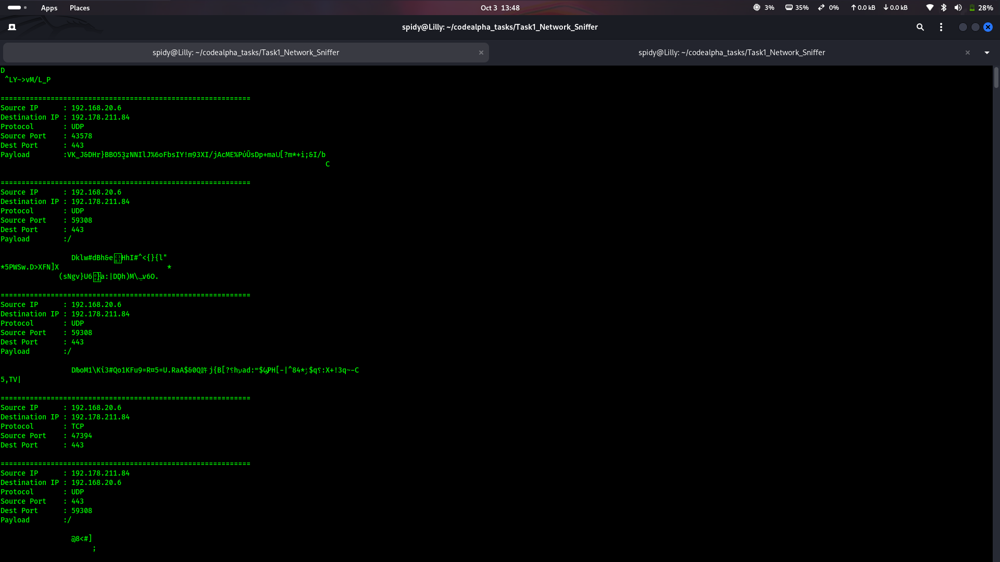
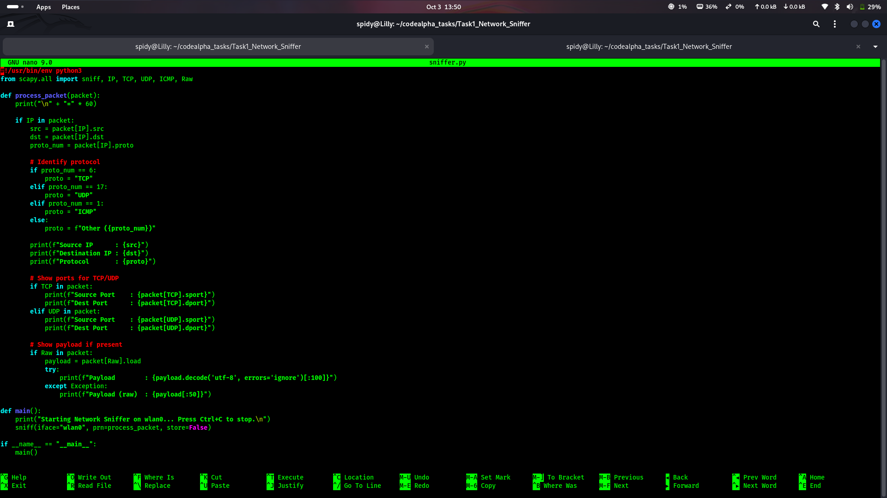
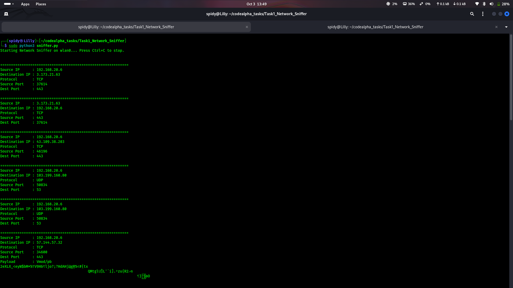

# Task 1: Basic Network Sniffer

**CodeAlpha Cyber Security Internship**  
**Author:** Gokul V  
**Student ID:** CA/DF1/312305  
**Domain:** Cyber Security

---

## 📌 Description

A Python-based network sniffer built with Scapy that captures live network
traffic and displays:

- Source IP address
- Destination IP address
- Protocol (TCP / UDP / ICMP)
- Source and destination ports
- Payload (decoded when possible)

This project demonstrates how data flows through a network and how
different protocols can be identified from raw packets.

---

## 🛠️ Tools & Environment

- **OS:** Kali Linux
- **Language:** Python 3
- **Library:** Scapy
- **Interface used:** wlan0

---

## 📦 Installation

```bash
sudo apt update
sudo apt install python3 python3-pip -y
pip3 install scapy
```

---

## 🚀 How to Run

1. Find your active network interface:
   ```bash
   ip a
   ```
2. Edit `sniffer.py` and set `iface` to your interface name (e.g., `wlan0`).
3. Run with root privileges:
   ```bash
   sudo python3 sniffer.py
   ```
4. Generate traffic in another terminal:
   ```bash
   ping google.com
   ```
5. Press `Ctrl+C` to stop.

---

## 📸 Screenshots

### Live packet capture


### Code preview


### Interface check


---

## 📄 Sample Output

```
============================================================
Source IP      : 192.168.20.6
Destination IP : 192.178.211.84
Protocol       : UDP
Source Port    : 59308
Dest Port      : 443
Payload        : /
============================================================
Source IP      : 192.168.20.6
Destination IP : 57.144.57.32
Protocol       : TCP
Source Port    : 34600
Dest Port      : 443
```

---

## 🔍 What I Learned

- How packets flow through a network
- Difference between TCP, UDP, and ICMP
- How to use Scapy for packet capture
- Why HTTPS payloads appear encrypted
- How to identify protocols from packet headers

---

## ⚠️ Ethical Note

This tool was used only on my own network for educational purposes as part
of the CodeAlpha Cyber Security Internship. No unauthorized networks were
monitored.
