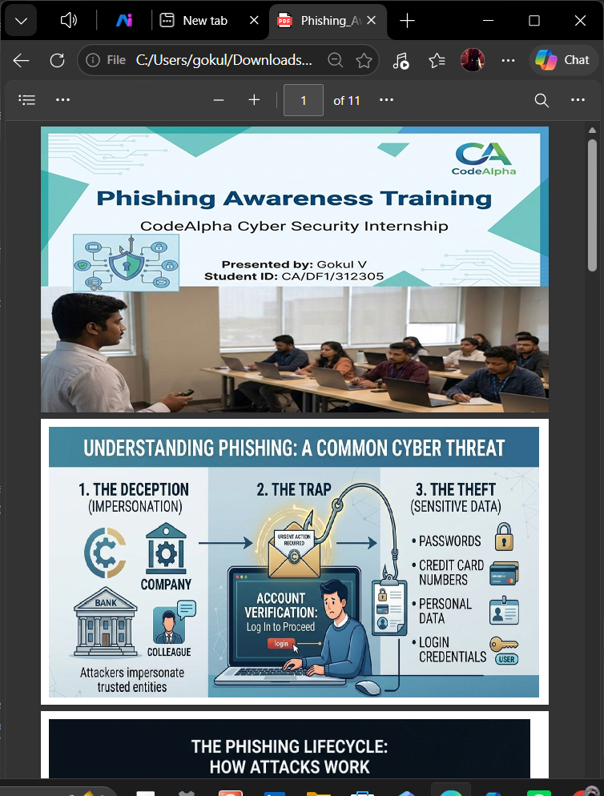
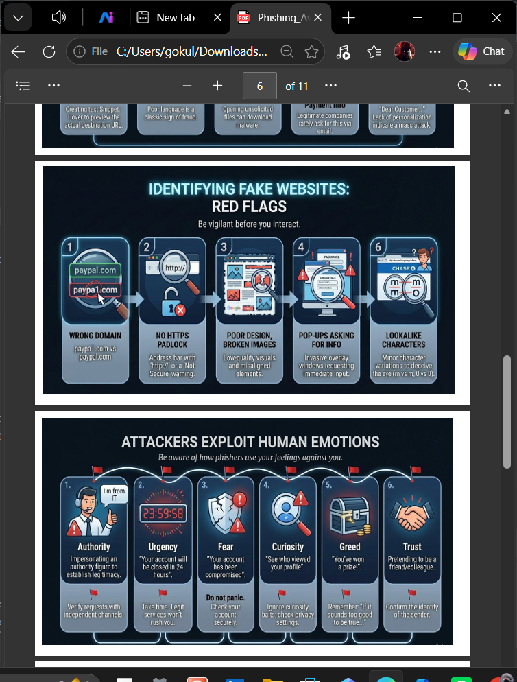
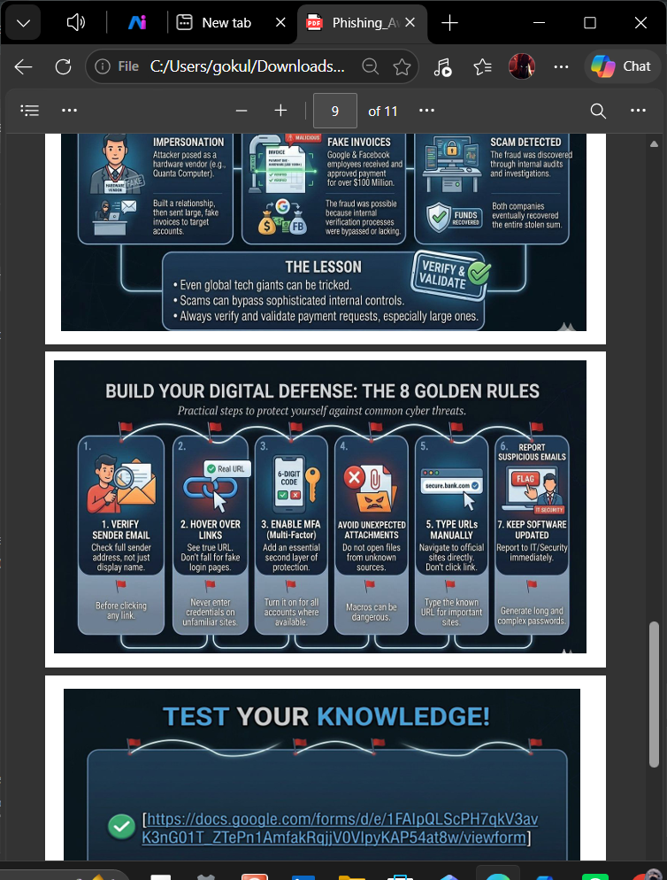

# Task 2: Phishing Awareness Training

**CodeAlpha Cyber Security Internship**  
**Author:** Gokul V  
**Student ID:** CA/DF1/312305  
**Domain:** Cyber Security

---

## 📌 Description

A comprehensive phishing awareness training module designed to educate
individuals about phishing attacks, how to recognize them, and how to
protect against them. This module includes a detailed presentation and an
interactive quiz to reinforce learning.

---

## 🎯 Objectives

- Understand what phishing is and how it works
- Identify different types of phishing attacks
- Recognize red flags in phishing emails and fake websites
- Understand social engineering tactics used by attackers
- Learn best practices to avoid falling victim
- Know what to do if you suspect a phishing attempt

---

## 📚 Topics Covered

1. **Introduction to Phishing** — Definition and importance
2. **How Phishing Works** — The phishing lifecycle
3. **Types of Phishing Attacks** — Email, Spear Phishing, Whaling, Smishing, Vishing, Clone
4. **Red Flags in Phishing Emails** — Urgency, spelling errors, mismatched addresses
5. **Recognizing Fake Websites** — Domain names, HTTPS, design clues
6. **Social Engineering Tactics** — Impersonation, urgency, fear, authority, curiosity, greed, trust
7. **Real-World Examples** — Google/Facebook $100M scam case study
8. **Best Practices** — The 8 Golden Rules for digital defense
9. **Incident Response** — What to do if you click a phishing link

---

## 🧠 Interactive Quiz

Test your knowledge with the phishing awareness quiz:

👉 **[Take the Quiz](https://docs.google.com/forms/d/e/1FAIpQLScPH7qkV3avK3nG01T_ZTePn1AmfakRqjjV0VlpyKAP54at8w/viewform)**

The quiz covers:
- What phishing is
- Red flags in emails and websites
- Social engineering tactics
- Best practices and incident response

---

## 📸 Screenshots

### Title Slide

### Identifying Fake Websites

### Quiz Preview

---

## 📁 Files

- `Phishing_Awareness_Training.pdf` — Full presentation (11 slides)
- `screenshots/` — Preview images of key slides

---

## 🔍 Key Takeaways

- Attackers exploit human emotions like urgency, fear, and trust
- HTTPS does not guarantee a website is safe
- Always verify the sender's full email address
- Hover over links to preview the real URL before clicking
- Enable Multi-Factor Authentication (MFA) everywhere
- Report suspicious emails to IT/security immediately

---

## ⚠️ Ethical Note

This training material was created for educational purposes as part of the
CodeAlpha Cyber Security Internship. It is intended to raise awareness and
help others recognize and avoid phishing attacks.
