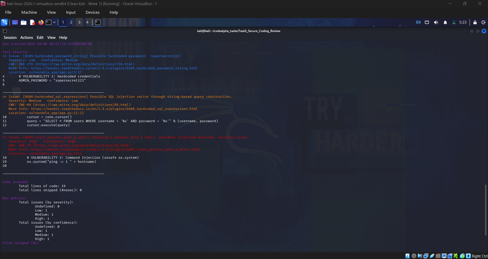
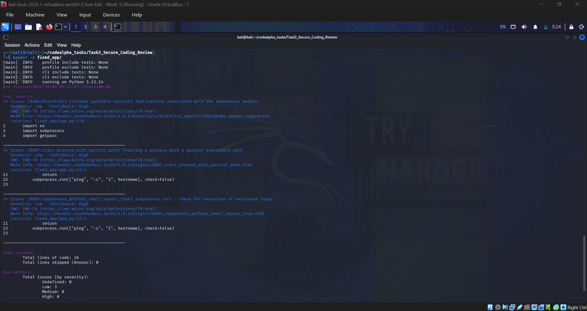
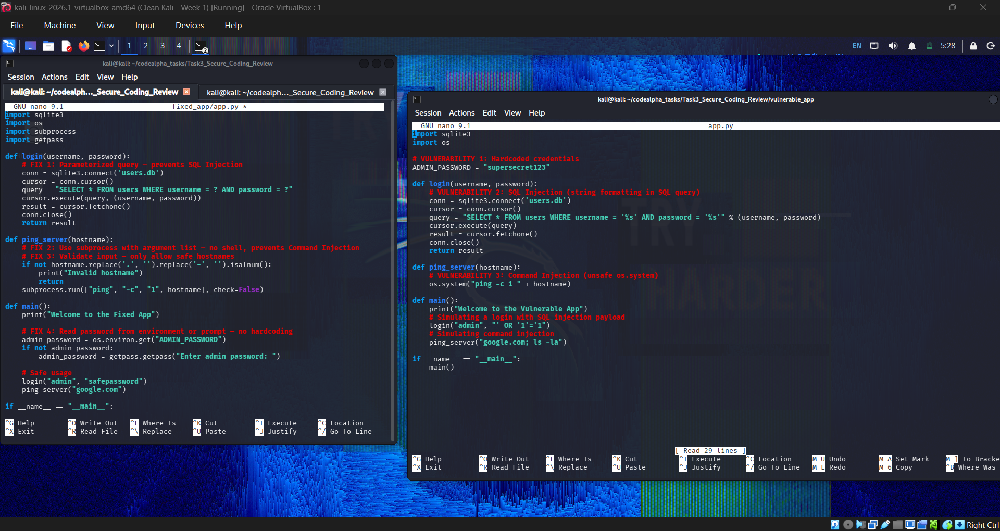

# Task 3: Secure Coding Review

CodeAlpha Cyber Security Internship  
Author: Gokul V  
Student ID: CA/DF1/312305  
Domain: Cyber Security

---

## Description

A secure coding review was performed on a deliberately vulnerable Python
application to identify security flaws, document them, and provide
remediation. The review used Bandit, a popular static analysis tool
for Python.

---

## Tools Used

- OS: Kali Linux
- Language: Python 3
- Scanner: Bandit 1.9.4
- Review Type: Static code analysis + manual inspection

---

## Vulnerabilities Found

| # | Vulnerability | Severity | CWE |
|---|---------------|----------|-----|
| 1 | Command Injection | High | CWE-78 |
| 2 | SQL Injection | Medium | CWE-89 |
| 3 | Hardcoded Password | Low | CWE-259 |

Detailed analysis and fixes are in report.md.

---

## Project Structure

Task3_Secure_Coding_Review/
- README.md
- report.md
- vulnerable_app/app.py      (original code with vulnerabilities)
- fixed_app/app.py           (remediated secure version)
- screenshots/
    - bandit_scan.png
    - bandit_fixed.png
    - code_comparison.png

---

## Screenshots

### Bandit scan on vulnerable code

### Bandit scan on fixed code

### Code comparison

---

## How to Reproduce

sudo apt install bandit -y
bandit -r vulnerable_app/
bandit -r fixed_app/

---

## Remediation Summary

| Vulnerability | Fix Applied |
|---------------|-------------|
| SQL Injection | Parameterized queries with ? placeholders |
| Command Injection | subprocess.run() with argument list + input validation |
| Hardcoded Password | Environment variable (os.environ.get()) |

---

## What I Learned

- How static analysis tools like Bandit detect vulnerabilities
- The difference between SQL injection and parameterized queries
- Why shell-based command execution is dangerous
- Best practices for secrets management in code
- The importance of secure coding in the SDLC

---

## Ethical Note

All testing was performed on locally created vulnerable code for educational
purposes as part of the CodeAlpha Cyber Security Internship.
